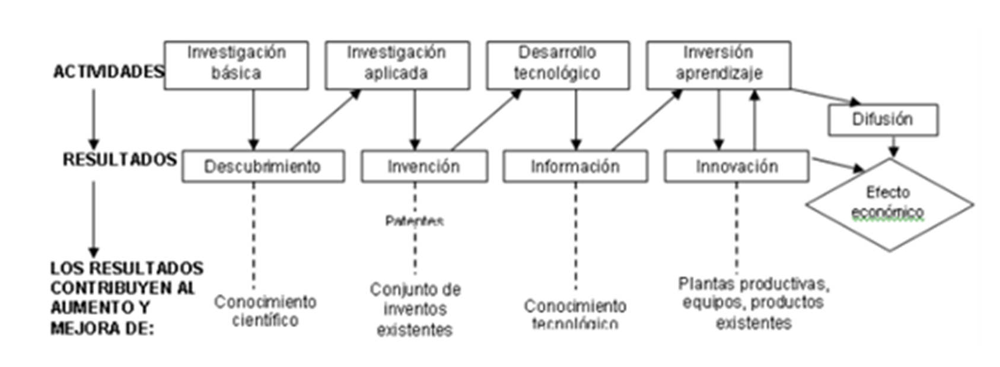
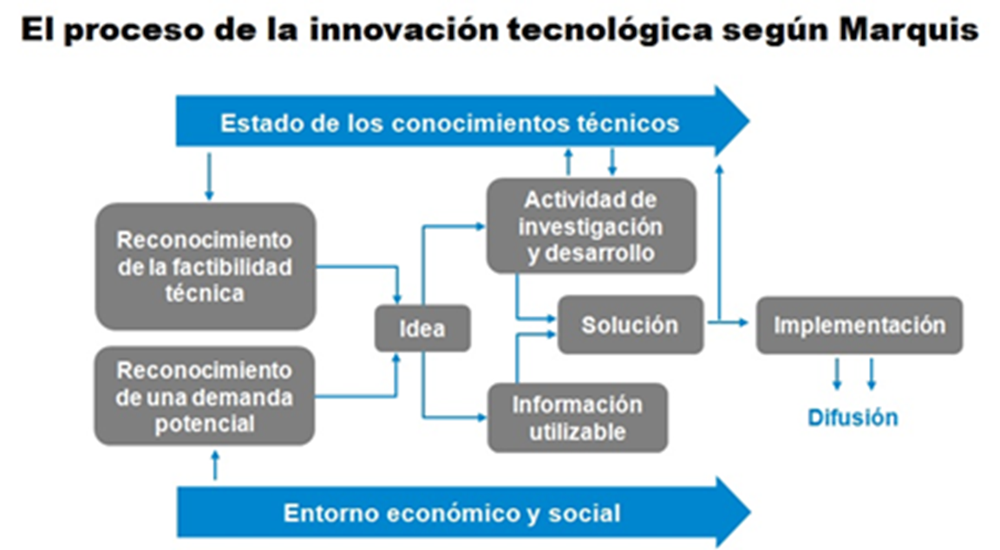
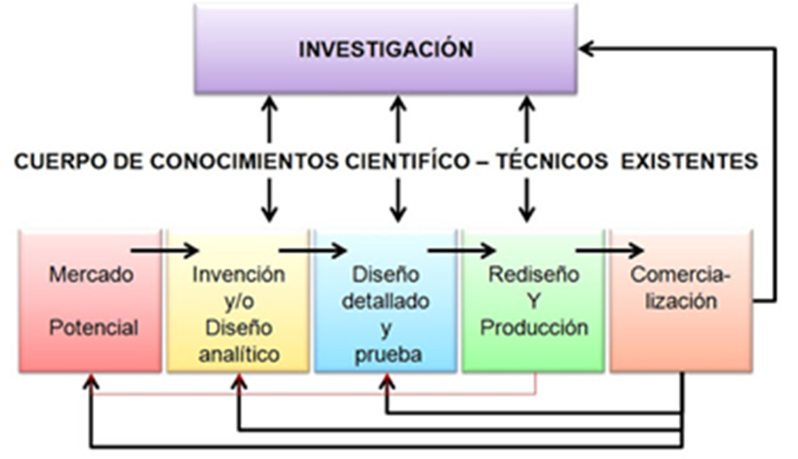
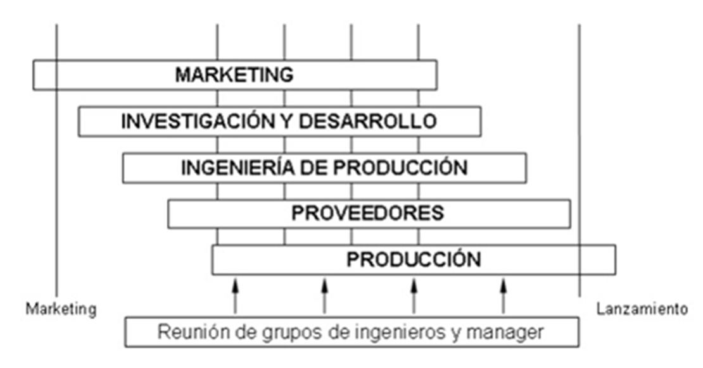
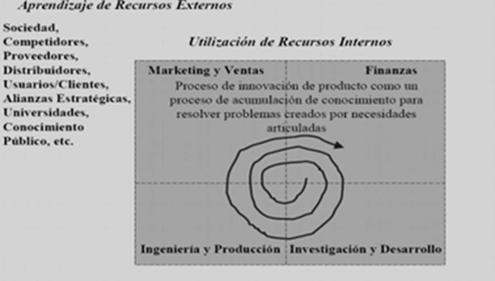

# PRESENTACIÓN NÚMERO 8 - INNOVACIÓN

## Brainstorming

### Información rápida y no filtrada

#### Recoger tantas ideas como sea posible, aunque alguna parezca descabellada, con la esperanza de que entre ellas se encuentre la definitiva para el proyecto o la labor en cuestión

## INNOVACIÓN

### Proceso de negocio que crea nuevos productos, servicios, procesos, modelos de negocio y mercados que entregan valor a sus usuarios

### Objetivo

### Crear productos con suficiente diferenciación y velocidad, de tal  forma que la empresa mantenga retornos por encima del promedio y proteja su sustentabilidad en el tiempo

#### Un modelo de innovación busca proyectos

- #### Deseables

- #### Técnicamente factibles

- #### Económicamente viables

## Modelos de primera generación

## Modelo Technology-Push

### Desarrollado por Roy Rothwell es predominante entre los años 1950-1960. Se trata de un modelo lineal, no demasiado realista, pero tiene la ventaja de introducir una serie de conceptos útiles en su momento

## Modelo Market-Pull

### Se enmarca entre los años 60 y 70 y también es Rothwell quien lo desarrolla. La principal ventaja de este modelo es que aunque sigue siendo lineal toma en consideración las necesidades del cliente, lo que permite una mejor aproximación a la realidad y compensa algo su linealidad

## Modelo Marquis (segunda generación)

### Es un modelo que nace en 1969 de manos del psicólogo estadounidense y expresidente de la Asociación Americana de Psicología (APA) Donald Marquis

## Modelo por etapas

### También es lineal como los anteriores, si bien incluye elementos tanto del empuje de la tecnología (Technology Push) como del tirón de la demanda (Market Pull)

### Cobra vigencia entre la segunda mitad de los años setenta y los primeros de la década del ochenta

## Modelo mixto (tercera generación)

## Modelo integrado de procesos (cuarta generación)

#### Surge porque a partir de la segunda mitad de la década de los 80 se comienza a considerar que las fases de la innovación, sobre todo desde el punto de vista operativo o de gestión, deben ser consideradas mediante procesos no secuenciales, es decir de procesos solapados o incluso simultáneos o concurrentes como consecuencia de la necesidad de acortar el tiempo de desarrollo del producto para introducirlo al mercado.

## Modelo en Sistemas en Red (quinta generación)

#### En la segunda mitad de la década de los 80 se incrementa de forma importante el número de alianzas estratégicas de carácter horizontal, basadas en la colaboración interempresarial para el desarrollo de la innovación.

#### La calidad es una actividad dominada: las empresas que no alcanzan este nivel, desaparecen.
#### El consumidor se empieza a acostumbrar a la buena calidad: empieza a exigir algo nuevo.
#### La calidad ya no es una estrategia para la competitividad industrial.

## Esquemas de innovación

- Individual

- Incremental

- Disruptiva